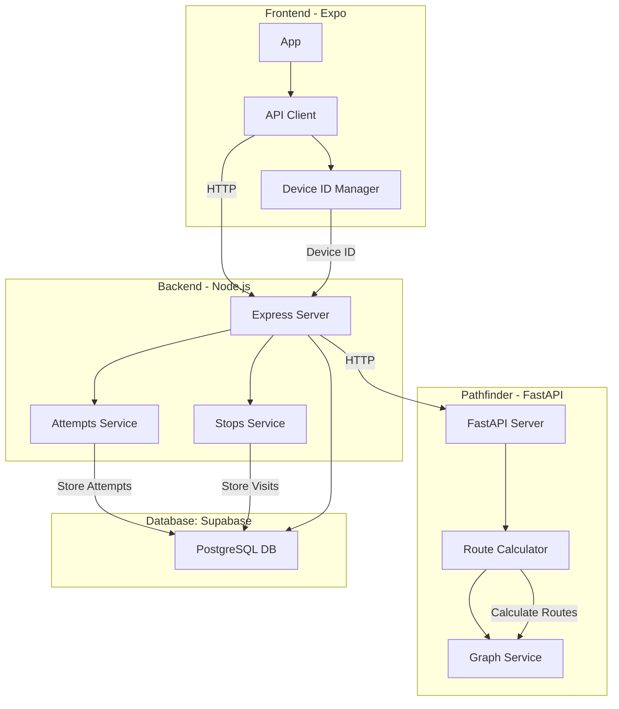
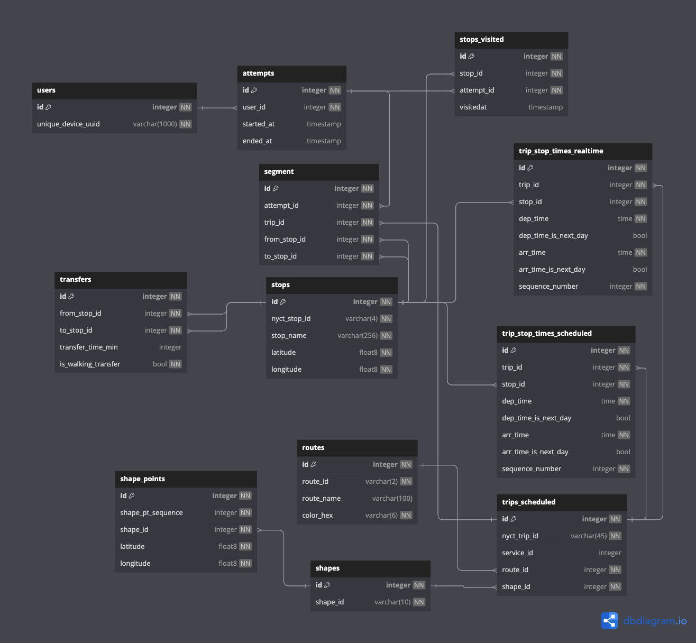

# NYC Subway Challenge
 
**By Trevor Foote**

<!-- TOC -->

- [Background](#background)
- [Design](#design)
  - [Architecture](#architecture)
  - [Frontend](#frontend)
  - [Backend](#backend)
  - [Database](#database)
  - [Pathfinding](#pathfinding)
- [Run it locally](#run-it-locally)

<!-- /TOC -->

This project is an iOS app that dynamically calculates the most optimal NYC Subway Challenge route based on realtime MTA data.

## Background

The "[Subway Challenge](https://en.wikipedia.org/wiki/Subway_Challenge)" is a challenge in which participants aim to visit all stops in the NYC Subway system in the shortest amount of time. These records are then certified and published by the Guiness Book of World Records. Participants may only use scheduled public transportation in their record attempts; so trains, buses, and travel on foot are permitted, but taxis or bikes are not. They must therefore determine and plan the most optimal route, taking into account travel times and the aforementioned limitations.

<details> 

  <summary>Why New York City? (click to expand)</summary>

  New York City boasts the metro system with the most stations in the World, and a pre-pandemic ridership of 5.5 million per day (a majority of the city's population). The Subway Challenge – although originating in New York – has been attempted in cities around the World including [London](https://en.wikipedia.org/wiki/Tube_Challenge), Paris, Berlin, and Delhi. New York City's subway challenge, however, remains especially interesting and challenging. These reasons are threefold:

  1. The large number of interchange stations in the network:
   
   To better illustrate my point about the complexity in planning a NYC Subway Challenge route, take <a href="https://cdn.ttc.ca/-/media/Project/TTC/DevProto/Images/Home/Routes-and-Schedules/Landing-page-pdfs/TTC_SubwayStreetcarMap_2021-11.pdf?rev=909317034177450b8b09ba5b247e24bf" target="_blank" rel="noopener noreferrer">the subway system of my current hometown Toronto</a> as an example, and suppose we're trying to determine a route to complete Toronto's Subway Challenge. For starters, it obviously wouldn't make much sense to start in the middle of a line, since we'd have to backtrack and thus we'd be redundantly traversing the same portion of track twice. So we know we have to start and end at either terminal or interchange stations. With this constraint in mind, you may begin to notice there really aren't that many permutations of routes to consider, and all the routes and their respective travel times could probably be manually calculated by hand in a couple hours. 

   Now consider <a href="https://www.mta.info/map/5256" target="_blank" rel="noopener noreferrer">the New York City Subway</a>. As you can see in the system map, there are way more interchange stations than the 5 that exist in Toronto. Adding more transfer opportunities to a network increases the number of possible routes factorially. You'll probably notice very quickly that it is impossible to determine every possible route plan (even assuming the aforementioned constraint). Attempters of the NYC Subway Challenge must therefore rely on assumptions and heuristics to prune out routes – for example perhaps starting and ending at more remote terminus stations on the network. 

  2. The network's uniquely extensive local-express dichotomy:


  Another factor adding to the number of possible routes is the local-express dichotomy that exists in a large portion of the NYC Subway system (particularly in Manhattan). While other subway systems around the World often have express tracks on portions of some lines, the New York City Subway is unique in how widespread this service pattern is. Express trains run on their own tracks and bypass certain "local" stations. While this isn't helpful for visiting local stations (since the rules define a "visit" to a station as the train stopping at that station to serve passengers), it can be helpful when backtracking on a particular line is needed, as we can bypass stops we've already visited. Essentially, every express station on a line with express service is also effectively an interchange station – even if it doesn't intersect with other lines – thus further ballooning the number of possible routes.

  3. The frequent and sometimes sudden service changes that take place:
  
  The New York City Subway system is notoriously unreliable. In addition to delays, trains are often diverted onto other lines or skip stations. The network's unique interlined design – where lines often merge with each other instead of simply intersecting – allows the MTA to divert trains onto other lines. For example, if there is an emergency at the *A/C/E train Fulton St station*, the MTA can divert A/C trains onto the F line between *W 4 St Wash Sq* and *Jay St MetroTech* stations.

</details> 

Initially, I had the idea of manually determining an optimal route for the NYC Subway Challenge, as is normally done by participants; however given my interest in graph problems, I quickly realized I could write algorithms to determine the most optimal route. As mentioned, a challenging aspect of completing the NYC Subway Challenge is the unreliability of the network. Sudden service interruptions and route diversions are commonplace. I therefore thought it would also be interesting to pull data from the MTA’s API and dynamically calculate the most optimal path based on current location and live updates from the MTA. My project thus includes:

  1. A pathfinding algorithm that – given inputs such as stations already visited, current station, and current travel times from the MTA API – determines the most optimal route to complete the Subway Challenge. 
  2. A user-facing iOS application which displays the route information and options to the user. The user of this project’s app would be the one attempting the Subway Challenge. This app will have a frontend that will provide an easily navigable UI for the user to compare options and see travel times, as well as input previously-visited stops. The app’s backend will pull live data from the MTA API and use the pathfinding algorithm to determine optimal routes. 
  


## Design

### Architecture

The app's architecture consists of the Expo Native frontend (iOS application), a Node.js backend, a Python Micro-service for pathfinding (determining the optimal route), and a relational DB. The backend API has various endpoints ([defined here](backend/openapi.yaml)). The API client in the frontend calls these endpoints to get optimal route calculations, as well as post newly-visited stops and starting/stopping attempts.



### Frontend

The app's frontend uses [React Native Expo](https://expo.dev/), an industry-standard open-source platform that allows devs to make universal native apps for iOS, Android, and web, using JS and React. While the scope of this project is limited to iOS (at least for now), using Expo enables easier development for Android in the future. [Tailwind CSS](https://tailwindcss.com/) is used for styling, which allows for consistent application of spacing, typography, colors, etc., and reduces how much CSS needs to be written. This allows for way faster prototyping.

### Backend

The backend is written in [Node.js](https://nodejs.org/en), allowing the entire stack to be written in Javacsript. This makes code sharing (types, utilities, validation, etc.) easier. Writing the backend using Node.js also allows for [Express](https://expressjs.com/) to be used to create the API. This makes API development way easier. Supabase (where I'm hosting the DB) also includes SDKs and client libraries for Node.js. 

### Database

The database for this project is a postgreSQL relational database hosted using [Supabase](https://supabase.com/). A relational database is needed to store users' attempt information, such as the last-calculated optimal route, what stops they've visited, and the start and end times of the attempt. The schema consists of two types of tables: 

- **"Static" tables** are populated once and not written to, for things like train routes, stations, and scheduled trips. This information is downloadable from the MTA as [static text files](static/mta-static/). The static tables were populated using [these scripts](static/scripts/). 
- **"Dynamic" tables** are the ones that are written to by the backend based on users' actions. These include users, active attempts by users, and their most optimal routes.



### Pathfinding

The code that actually computes the graph problem and calculates the most optimal route doesn't sit on the primary backend API, but rather in its own Python micro-service, which the backend calls as a client. While the pathfinding algorithms *could* have also been written in Javascript within the backend API, I decided to write in Python for 2 reasons:

- Easier to solve these kinds of complex graph problems using Python, with tools like [NetworkX](https://networkx.org/)
- The micro-service can take advantage of the [nyct-gtfs Python package](https://github.com/Andrew-Dickinson/nyct-gtfs), which converts the MTA API's realtime data from its original protobuf-encoded format to understandable Python objects. This saves a bunch of effort in parsing and organizing data from the MTA's API.

The pathfinder starts with a list of *scheduled* trains for the day. It then pulls all realtime data from the MTA's Subway APIs, which returns realtime train data for the next few hours, and replaces all scheduled train trips with realtime train trips (thus essentially replacing scheduled trip info with real info) wherever possible. It then uses these trips to construct a  time-dependent graph, which, along with heuristics and pruning, is used to solve for the most optimal route.

> **Note:** as of writing this, the pathfinding algorithm hasn't been implemented yet. (I'm focusing on implementing the rest of the app first.) More to come.


## Run it locally

To run the app locally, open 2 Terminals:

Backend:
```bash
docker compose up --build
```

Frontend:
```bash
cd frontend
npx expo start --clear
```
Then follow the instructions given by Expo Go to view the app on your own device or on an iOS Simulator (MacOS & Swift required).
